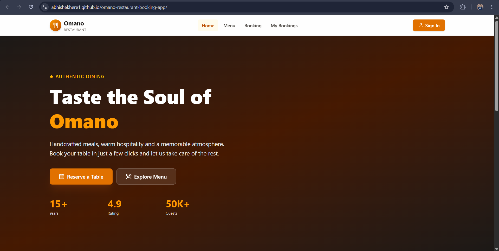
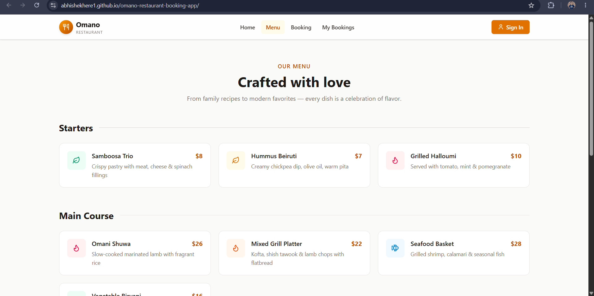
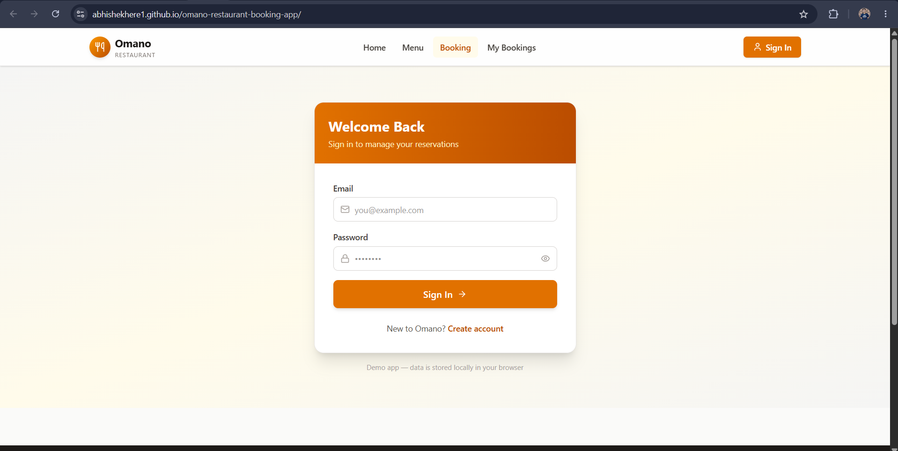

# 🍽️ OMANO Restaurant Booking App

A modern and responsive restaurant booking website that allows users to explore the restaurant, view menu highlights, and make table reservations through an elegant user interface.

## 🌐 Live Demo

🔗 Live Website: https://abhishekhere1.github.io/omano-restaurant-booking-app/

## 📂 GitHub Repository

🔗 Repository: https://github.com/Abhishekhere1/omano-restaurant-booking-app

---

# 📖 About The Project

OMANO Restaurant Booking App is a responsive web application designed to provide users with a smooth restaurant reservation experience. The project focuses on clean UI/UX design, modern layouts, responsive sections, and an attractive booking interface.

Whether users are browsing restaurant information, checking featured dishes, or reserving a table, the application delivers a seamless experience across desktop, tablet, and mobile devices.

---

# ✨ Features

- 🍽️ Modern Restaurant Landing Page
- 📱 Fully Responsive Design
- 📋 Interactive Booking Form
- 🍔 Menu Showcase Section
- ⭐ Customer Testimonials
- 📍 Contact & Location Section
- 🎨 Attractive UI Design
- ⚡ Fast Loading Performance
- 🌙 Clean User Experience

---

# 🛠️ Tech Stack

### Frontend
- HTML5
- CSS3
- JavaScript

### Deployment
- GitHub Pages

---

# 📁 Project Structure

```bash
omano-restaurant-booking-app/
│
├── index.html
├── css/
│   └── style.css
│
├── js/
│   └── script.js
│
├── images/
│   └── ...
│
└── README.md
```

> Update the structure above according to your actual project folders if needed.

---

# 🚀 Getting Started

## Clone The Repository

```bash
git clone https://github.com/Abhishekhere1/omano-restaurant-booking-app.git
```

## Navigate To Project Folder

```bash
cd omano-restaurant-booking-app
```

## Run The Project

Simply open:

```bash
index.html
```

or use VS Code Live Server.

---

# 📸 Screenshots

## 🏠 Home Page



> Replace with your actual screenshot.

---

## 🍔 Menu Section



> Replace with your actual screenshot.

---

## 📅 Booking Section



> Replace with your actual screenshot.

---


# 🎯 Future Improvements

- Online Payment Integration
- User Authentication
- Real-Time Table Availability
- Reservation Management Dashboard
- Email Confirmation System
- Admin Panel

---

# 👨‍💻 Author

### Abhishek Kumar

- GitHub: https://github.com/Abhishekhere1
- Project: OMANO Restaurant Booking App

---

# 🤝 Contributing

Contributions, issues, and feature requests are welcome.

Feel free to fork the project and submit a pull request.

---

# ⭐ Support

If you like this project, please give it a ⭐ on GitHub.

---

# 📄 License

This project is open source and available under the MIT License.
